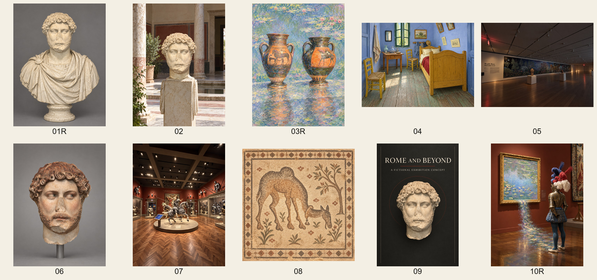

# Image 2.5 Museum Transformation Benchmark

A compact visual benchmark for reference-conditioned image transformation. Ten generated outputs test source fidelity, geometric consistency, instruction adherence, plausibility, and aesthetic quality across sculpture completion, scene reconstruction, style transfer, museum relighting, polychromy, narrative transformation, mosaic expansion, and poster design.



## Results

| Metric | Result |
|---|---:|
| Viewable completion | **10/10** |
| Strict passes | **6/10** |
| Composite mean | **3.97 / 5** |
| Source fidelity | **3.80** |
| Geometric consistency | **4.20** |
| Instruction adherence | **3.90** |
| Plausibility | **4.00** |
| Aesthetic quality | **4.10** |

[Open the scored gallery](https://az9713.github.io/image-2-5-museum-benchmark/) for all ten source-to-transformation comparisons, per-case dimension scores, pass/fail decisions, and concise failure analysis.

## What this project measures

Each transformation is scored from 1 to 5 on five dimensions:

- **F — source fidelity:** preservation of identity-bearing forms, counts, layout, viewpoint, damage, and protected relationships.
- **G — geometric consistency:** perspective, topology, occlusion, contact, scale, frame boundaries, and shadow coherence.
- **I — instruction adherence:** positive requirements, exclusions, counts, and case-specific critical conditions.
- **P — plausibility:** physical, material, semantic, narrative, and—where relevant—historical plausibility.
- **A — aesthetic quality:** composition, hierarchy, color, light, finish, and intentionality.

The weighted score is:

```text
S = 0.30F + 0.25I + 0.20G + 0.15P + 0.10A
```

A case passes only when all of the following hold:

1. `S >= 3.50`
2. `F >= 3`
3. `I >= 3`
4. every case-specific critical condition passes
5. no hard failure applies

This conjunctive rule prevents a polished but incorrect image from passing through aesthetic compensation.

## Suite composition

The ten-slot composite contains two distinct evidence classes:

- **Seven original benchmark cases:** 02, 04, 05, 06, 07, 08, and 09.
- **Three policy-safe proxy cases:** 01R, 03R, and 10R.

The R-suffix cases use changed subjects or reduced geometric complexity after the corresponding original requests were blocked by output moderation. They are useful operational substitutes, but they are **not equivalent completions** of original cases 01, 03, and 10. The 3.97 result is therefore a mixed-suite composite, not a corrected score for the original frozen benchmark.

## Main findings

- Geometry and finish were consistently strong.
- Conservative damaged-sculpture completion worked well when the inferred body was fully draped.
- The clearest weakness was reference-role separation: a style-transfer result copied literal pond content from the style reference.
- Complex coordinated motion remained difficult to verify reliably.
- Models sometimes over-amplified a deliberately restrained interaction into a spectacle.
- Source-description errors can dominate the apparent model error; benchmark prompts require the same scrutiny as outputs.

## Repository contents

```text
.
├── index.html                     # dependency-free scored gallery
├── assets/
│   ├── benchmark-contact-sheet.jpg
│   ├── outputs/                   # ten metadata-stripped transformations
│   └── sources/                   # nine sanitized source derivatives
├── data/
│   ├── manifest.json              # public provenance and file hashes
│   └── scorecard.csv              # machine-readable composite scores
└── docs/
    └── report.md                  # methodology and diagnostic interpretation
```

The gallery is static and has no external scripts, fonts, analytics, or network dependencies. Clone or download the repository and open `index.html` in a browser.

## Reproducibility boundary

No images were regenerated for the composite release. Item-level judgments were inherited from the locked parent and proxy evaluations, and the ten-slot aggregate was recomputed from those scores. A same-evaluator rescore after prior exposure would not be an independent blind evaluation, so the project does not present it as one.

The image-generation interface did not expose a stable model endpoint identifier, seed control, quality control, or reference-strength control. The local generation evidence reported `gpt-image` version `2.0` in C2PA assertions, but all public image derivatives were intentionally stripped of embedded metadata.

## Privacy and source policy

This repository is a sanitized publication subset. It includes nine lower-resolution, metadata-free source derivatives so every transformation can be compared with its actual input reference or references. Photographs containing visitors were cropped or visibly pixelated before publication.

It excludes:

- original full-resolution and unredacted museum photographs;
- workstation paths and usernames;
- account names and email addresses;
- Codex task IDs and provider receipt IDs;
- shared-chat URLs;
- raw run manifests, contact sheets, transport images, and local audit notes;
- embedded image metadata.

The unredacted source photographs remain local. The sanitized derivatives preserve benchmark-relevant composition while preventing bystander identification. Generated images are presented for model-evaluation and research discussion; historical reconstructions are labeled hypothetical where object-specific evidence is unavailable.

## Suggested next experiment

Use a controlled reference-role factorial: hold subject geometry fixed, then independently ask a second reference to supply only palette, brushwork, lighting, or scene content. This isolates exactly where style-content entanglement begins and yields more information than another collection of unrelated prompts.
